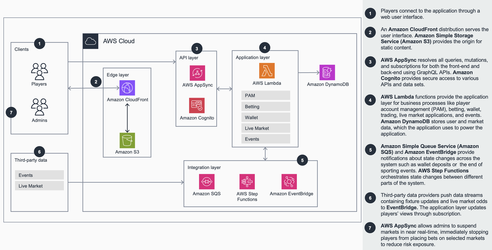

# Guidance Title (required)

Guidance for Building an Event-Driven Sportsbook on AWS.

**Example:** *Guidance for Product Substitutions on AWS*

This title correlates exactly to the Guidance it’s linked to, including its corresponding sample code repository. 


## Table of Contents (required)

List the top-level sections of the README template, along with a hyperlink to the specific section.

### Required

1. [Overview](#overview-required)
    - [Architecture](#Architecture)
    - [Cost](#cost)
2. [Prerequisites](#prerequisites-required)
    - [Operating System](#operating-system-required)
3. [Deployment Steps](#deployment-steps-required)
4. [Deployment Validation](#deployment-validation-required)
5. [Running the Guidance](#running-the-guidance-required)
6. [Next Steps](#next-steps-required)
7. [Cleanup](#cleanup-required)
8. [Notices](#notices-optional)

***Optional***

8. [FAQ, known issues, additional considerations, and limitations](#faq-known-issues-additional-considerations-and-limitations-optional)
9. [Revisions](#revisions-optional)
10. [Authors](#authors-optional)

## Overview

This application demonstrates how to build an event-driven, serverless sportsbook application on AWS to help betting operating operators effectively handle spiky and seasonal traffic. Using microservices and serverless computing, the application shows operators how to overcome the scaling limitations of traditional sportsbook applications. Each microservice has its own documentation that provides more details about its purpose, architecture, and implementation.

Select a link from the following list to learn more about the microservice.

- [Auth Service](/infrastructure/lambda/auth/README.md) - Handles user authentication and authorization
- [Betting Service](/infrastructure/lambda/betting/README.md) - Manages betting operations
- [GraphQL Service](/infrastructure/lambda/gql/README.md) - Provides the GraphQL API layer
- [Live Market Service](/infrastructure/lambda/livemarket/README.md) - Handles live market data
- [Sporting Events Service](/infrastructure/lambda/sportingevents/README.md) - Manages sporting event data
- [System Events Service](/infrastructure/lambda/systemevents/README.md) - Handles system-wide events
- [Third Party Service](/infrastructure/lambda/thirdparty/README.md) - Integrates with third-party providers
- [Trading Service](/infrastructure/lambda/trading/README.md) - Manages trading operations
- [User Service](/infrastructure/lambda/user/README.md) - Handles user management
- [Wallet Service](/infrastructure/lambda/wallet/README.md) - Manages user wallet operations

### High Level Architecture



### Cost ( required )

This section is for a high-level cost estimate. Think of a likely straightforward scenario with reasonable assumptions based on the problem the Guidance is trying to solve. Provide an in-depth cost breakdown table in this section below ( you should use AWS Pricing Calculator to generate cost breakdown ).

Start this section with the following boilerplate text:

_You are responsible for the cost of the AWS services used while running this Guidance. As of <month> <year>, the cost for running this Guidance with the default settings in the <Default AWS Region (Most likely will be US East (N. Virginia)) > is approximately $<n.nn> per month for processing ( <nnnnn> records )._

Replace this amount with the approximate cost for running your Guidance in the default Region. This estimate should be per month and for processing/serving resonable number of requests/entities.

Suggest you keep this boilerplate text:
_We recommend creating a [Budget](https://docs.aws.amazon.com/cost-management/latest/userguide/budgets-managing-costs.html) through [AWS Cost Explorer](https://aws.amazon.com/aws-cost-management/aws-cost-explorer/) to help manage costs. Prices are subject to change. For full details, refer to the pricing webpage for each AWS service used in this Guidance._

### Sample Cost Table ( required )

**Note : Once you have created a sample cost table using AWS Pricing Calculator, copy the cost breakdown to below table and upload a PDF of the cost estimation on BuilderSpace. Do not add the link to the pricing calculator in the ReadMe.**

The following table provides a sample cost breakdown for deploying this Guidance with the default parameters in the US East (N. Virginia) Region for one month.

| AWS service  | Dimensions | Cost [USD] |
| ----------- | ------------ | ------------ |
| Amazon API Gateway | 1,000,000 REST API calls per month  | $ 3.50month |
| Amazon Cognito | 1,000 active users per month without advanced security feature | $ 0.00 |

## Prerequisites

### Operating System

These deployment instructions are optimized to best work on **<Amazon Linux 2 AMI>**. Deployment to other operating systems may require additional steps.

The following tools are required to install the sample application.
- AWS CLI >= 2.15
- AWS SAM CLI >= 1.136


### Third-party tools

- NodeJS >= 22.18
- Python >= 3.12


## Deployment Steps

1. Clone the repo using command.
    ```bash
    git clone https://github.com/aws-solutions-library-samples/guidance-for-building-an-event-driven-sportsbook-on-aws.git event-driven-sportsbook
    ```

2. Change directory to the repository folder.
    ```bash
    cd event-driven-sportsbook
    ```

3. Initialise a Python virtual environment.
    ```bash
    python3 -m venv .venv
    ```

4. Activate the virtual environment.
    ```bash
    source .venv/bin/activate
    ```

5. Install the required Python libraries to the virtual environment.
    ```bash
    python3 -m pip install -r requirements.txt
    ```

6. Open the `samconfig.toml` file and set the AWS reqion to host the application.  
    - `region`
        - _**Description:**_ The AWS region where the application will be deployed.
        - _**Default:**_ `eu-west-2`

7. Build and deploy the microservices.
    ```bash
    sam build
    sam deploy --config-file samconfig.toml
    ```

8. Install web application npm dependencies.
    ```
    npm install
    ``` 

9. Update the web application configuration, then build and deploy the web application.
    ```bash
    npm run config
    npm run build
    npm run deploy
    ```
    > [!TIP]
    > In order, these commands:
    > 1. Generates a `.env.local` file with stack outputs from the infrastructure build
    > 2. Builds the frontend application
    > 3. Copies the application build to the s3 bucket that CloudFront points at


## Deployment Validation

* Using the AWS Management Console, open CloudFormation and verify that the sportsbook CloudFormation stack was successfully deployed.
* Get the web application URL - WebUrl from the sportsbook CloudFormation stack outputs.


## Running the Guidance

* Go to the web application using a web browser.
* Register an account using a valid email address.


## Next Steps

Complete the Event-driven Sportsbook workshop to understand how the application works.


## Cleanup

1. Log intto the AWS Management Console then empty the sportsbook WebUIBucket Amazon S3 bucket.

2. Delete the sportsbook CloudFormation stack by executing the following command from the project root directory.
    ```bash
    sam delete --config-file samconfig.toml
    ```


## FAQ, known issues, additional considerations, and limitations (optional)


**Known issues (optional)**

<If there are common known issues, or errors that can occur during the Guidance deployment, describe the issue and resolution steps here>


**Additional considerations (if applicable)**

<Include considerations the customer must know while using the Guidance, such as anti-patterns, or billing considerations.>

**Examples:**

- “This Guidance creates a public AWS bucket required for the use-case.”
- “This Guidance created an Amazon SageMaker notebook that is billed per hour irrespective of usage.”
- “This Guidance creates unauthenticated public API endpoints.”


Provide a link to the *GitHub issues page* for users to provide feedback.


**Example:** *“For any feedback, questions, or suggestions, please use the issues tab under this repo.”*

## Revisions (optional)

Document all notable changes to this project.

Consider formatting this section based on Keep a Changelog, and adhering to Semantic Versioning.

## Notices ( required )

Include below mandatory legal disclaimer for Guidance

*Customers are responsible for making their own independent assessment of the information in this Guidance. This Guidance: (a) is for informational purposes only, (b) represents AWS current product offerings and practices, which are subject to change without notice, and (c) does not create any commitments or assurances from AWS and its affiliates, suppliers or licensors. AWS products or services are provided “as is” without warranties, representations, or conditions of any kind, whether express or implied. AWS responsibilities and liabilities to its customers are controlled by AWS agreements, and this Guidance is not part of, nor does it modify, any agreement between AWS and its customers.*


## Authors (optional)

Name of code contributors
